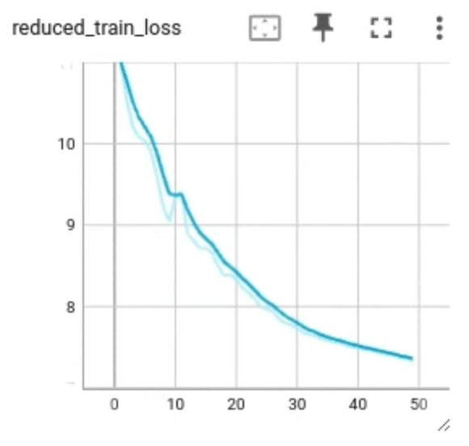
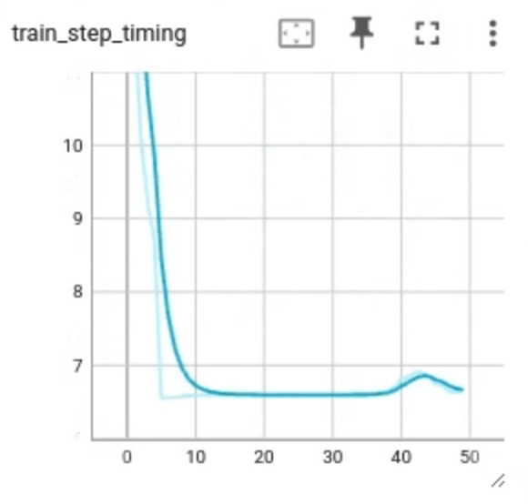

# NeMo Framework on Google Kubernetes Engine (GKE) to train Megatron LM

This repository contains an end-to-end walkthrough of training NVIDIA's NeMo Megatron Large Language Model (LLM) using NeMo framework on Google Kubernetes Engine.

## Table of Contents

- [Introduction to NVIDIA NeMo Framework](#introduction-to-nvidia-nemo-framework)
- [NVIDIA GPUs on Google Cloud](#nvidia-gpus-on-google-cloud)
- [Training AI/ML workloads on GKE](#training-aiml-workloads-on-gke)
- [Prerequisites](#prerequisites)
  - [Hardware Requirements](#hardware-requirements)
  - [Software Requirements](#software-requirements)
- [Walkthrough](#walkthrough)
  - [Security](#security)
  - [Bootstrapping](#bootstrapping)
  - [Cluster Setup](#cluster-setup)
  - [Configure](#configure)
  - [Model Training](#model-training)
    - [Data curation](#data-curation-using-gcs-bucket)
    - [NeMo training Image](#training-image)
    - [Configure model parameters](#configure-model-parameters)
    - [Launch training using Helm](#launch-training-using-helm)
  - [Observations](#observations)
    - [TensorBoard using Open-source](#tensorboard-using-open-source)
    - [TensorBoard using Vertex AI](#tensorboard-using-vertex-ai)
    - [Dashboard - Scalars](#dashboard---scalars)
      - [Reduced Train Loss](#reduced-train-loss)
      - [Train Step Timing](#train-step-timing)
  - [Teardown](#teardown)
  - [Troubleshooting](#troubleshooting)
    - [Kueue Configuration issue](#kueue-configuration-issue)
    - [TensorBoard Installation issue](#tensorboard-open-source-installation)
    - [PVC deletion fails](#pvc-deletion-fails)
    - [Docker login failure](#docker-login-failure)
- [Beyond the Walkthrough](#beyond-the-walkthrough)
- [Versioning](#versioning)
- [Code of Conduct](#code-of-conduct)
- [Contributing](#contributing)
- [License](#license)

## Introduction to NVIDIA NeMo Framework

NVIDIA NeMo™ is an end-to-end platform for development of custom generative AI models anywhere. NVIDIA NeMo framework is designed for enterprise development, it utilizes NVIDIA's state-of-the-art technology to facilitate a complete workflow from automated distributed data processing to training of large-scale bespoke models using sophisticated 3D parallelism techniques, and finally, deployment using retrieval-augmented generation for large-scale inference on an infrastructure of your choice, be it on-premises or in the cloud.

For enterprises running their business on AI, NVIDIA AI Enterprise provides a production-grade, secure, end-to-end software platform that includes NeMo as well as generative AI reference applications and enterprise support to streamline adoption. Now organizations can integrate AI into their operations, streamlining processes, enhancing decision-making capabilities, and ultimately driving greater value.

To understand more about NVIDIA NeMo, click [here](https://www.nvidia.com/en-us/ai-data-science/generative-ai/nemo-framework/)

## NVIDIA GPUs on Google Cloud

Google Kubernetes Engine (GKE) supports a broad range of NVIDIA graphics processing units (GPUs) that can be attached to the GKE nodes containing one or more Compute Virtual Machine instances. These GPUs are purpose built to accelerate a diverse array of AI/ML workloads including Large Language Model (LLM) training and inference. Within GKE, virtual machines with NVIDIA GPUs are setup in a passthrough mode. This setup grants VMs direct control over the GPU, enhancing their capabilities and their associated memory.

Below list shows the GPUs supported in GKE. The detailed list is available [here](https://cloud.google.com/compute/docs/gpus#nvidia_gpus_for_compute_workloads)

|  | NVIDIA GPU | VM | Machine-type(s) | GPUs | vCPUs | Memory (GB) |
|---|---|---|---|---|---|---|
| 1. | [H100](<https://www.nvidia.com/en-us/data-center/h100/>) <sup>1</sup> | [A3](https://cloud.google.com/compute/docs/accelerator-optimized-machines#a3-vms) | `a3-highgpu-8g` | 8 | 208 | 1872 |
| 2. | [A100](https://www.nvidia.com/en-us/data-center/a100/) | [A2 standard](https://cloud.google.com/compute/docs/accelerator-optimized-machines#a2-standard-vms) | `a2-highgpu-1g` - `a2-highgpu-8g` <br> `a2-megagpu-16g` | 1-16 | 12-96 | 85-1360 |
| 3. | [A100](https://www.nvidia.com/en-us/data-center/a100/) | [A2 ultra 80GB](https://cloud.google.com/compute/docs/accelerator-optimized-machines#a2-ultra-vms) | `a2-ultragpu-1g` - `a2-ultragpu-8g`| 1-8 | 12-96 | 170-1360 |
| 4. | [L4](https://www.nvidia.com/en-us/data-center/l4/) | [G2](https://cloud.google.com/compute/docs/accelerator-optimized-machines#g2-standard-vms) | `g2-standard-4` - `g2-standard-96`| 1-8 | 4-96 | 16-384 |

[1] The walkthrough below will need access to A3 VMs.

## Training AI/ML workloads on GKE

GKE is prevalent in Web, Stateful and Batch workloads, its footprint in AI/ML space for training and inference is increasing. It provides access to the latest NVIDIA GPUs, Storage - object and block and rapid networking. The inherent features such as Auto-scaling, Placements and Self-healing along with support for Local SSDs, GCS Fuse, Fast Socket, and gVNIC augment the network, storage and communication performance across the stack. In addition, it has an ecosystem of first-party and third-party integrations, frameworks, tools and libraries.

This technical walkthrough demonstrates the process of training the NeMo Megatron model on A3 virtual machines in a Google Kubernetes Engine (GKE) environment leveraging the GPUDirect-TCPX technology. The A3 virtual machines are equipped with 8 NVIDIA H100 Tensor Core GPUs and 4 network interface controllers (NICs), each with a bandwidth of 200 gigabits per second. This configuration leverages GPUDirect-TCPX to facilitate direct transfers between GPUs and NICs.

NVIDIA NeMo framework sits on top of the GKE setup. The NeMo training image (available in [NVIDIA NGC](https://www.nvidia.com/en-us/gpu-cloud/)) is used to train the model along with PyTorch and NVIDIA CUDA libraries. The infrastructure can be used by more than one team to build, train, customize and deploy LLMs for GenAI.

[](HighLevelArch)

## High-Level flow

[](HighLevelFlow)

The logical flow of the walkthrough consists of below steps:

1. **Setup**: Infrastructure is provisioned; GKE Cluster with Node pools, GPUs and SSDs, Artifact Registry
2. **Configure**: Configurations of components such as Kubernetes Kueue, Filestore and GCS for storage, GKE networking (Device mode) and TensorBoard
3. **Onboard**: Public dataset (For instance: Wikipedia) is made ready by tokenizing using GPT2BPETokenizer
4. **Training**: NVIDIA NeMo framework Image is used to train the Megatron-LM
5. **Results**: Model training results can be viewed in TensorBoard to assess and re-train as necessary

## Prerequisites

### Hardware Requirements

As the walkthrough depends on the availability of NVIDIA H100 GPUs accessible as A3 machines on Google Cloud, it is important you have access to them. In certain instances, submitting a request to ensure the allocation of quotas to your project is a necessary prerequisite. [Submit quota request](https://cloud.google.com/docs/quota/view-manage#requesting_higher_quota) for [GPU Quota](https://cloud.google.com/compute/resource-usage#gpu_quota) named `NVIDIA_H100_GPUS`

### Software Requirements

The following CLI tools are required in order to complete the walkthrough in your Google Cloud project:

1. [Google Cloud Project](https://console.cloud.google.com) with billing enabled
2. [gcloud CLI](https://cloud.google.com/sdk/docs/install)
3. [Terraform](https://developer.hashicorp.com/terraform/tutorials/gcp-get-started/install-cli)
4. [Git](https://git-scm.com/book/en/v2/Getting-Started-Installing-Git)
5. [Kubectl](https://kubernetes.io/docs/tasks/tools/install-kubectl-linux/)
6. Access to NVIDIA GPU Cloud (NGC)
    - Install [NGC CLI](https://docs.ngc.nvidia.com/cli/cmd.html)
    - [NGC Big NLP Training Docker images](https://registry.ngc.nvidia.com/orgs/ea-bignlp/containers/bignlp-training)

## Walkthrough

> [!NOTE]
> Before you proceed further, ensure all CLI tools listed [above](#software-requirements) are installed and configured.

### Security

Default Compute Engine service account.

### Bootstrapping

The bootstrap phase initializes the Google Cloud project and terraform environment for resources state management.

1. Download [source](https://github.com/GoogleCloudPlatform/NVIDIA-nemo-on-gke.git)

    ```console
    git clone https://github.com/GoogleCloudPlatform/NVIDIA-nemo-on-gke.git
    cd NVIDIA-nemo-on-gke/infra
    ```

2. Configure gcloud

    ```console
    gcloud auth login
    gcloud auth application-default login
    gcloud config set project [project name]
    ```

3. Configure environment per requirements in [terraform.auto.tfvars](./infra/1-bootstrap/terraform.auto.tfvars)

    | Variable | Description | Default | Need update? |
    |---|---|---|---|
    | `project_id` | Google Project ID | <> | *Yes* |
    | `tf_state_bucket.name` | GCS Bucket for terraform state management | <> | *Yes* |
    | `tf_state_bucket.location` | GCP Region | <> | *Yes* |

    Save changes in the `terraform.auto.tfvars` file

    ```console
    cd 1-bootstrap
    terraform init
    terraform apply
    ```

    **Validate**: Terraform finishes successfully.

    ```console
    terraform apply
    Apply complete! Resources: 0 added, 0 changed, 0 destroyed.
    ```

### Cluster Setup

The Cluster setup provisions:

- [ ] GKE cluster with 2 node pools:
  - [ ] Default: One `e2-standard-4` instance
  - [ ] Managed: Multiple `a3-highgpu-1g` instance with H100 GPU(s)
- [ ] 5 VPCs each with a subnet
- [ ] NVIDIA GPU drivers installed

1. Configure Cluster per requirements in [terraform.auto.tfvars](./infra/2-setup/terraform.auto.tfvars)

    | Variable | Description | Default | Need update? |
    |---|---|---|---|
    | `zone` | GCP zone within region to provision resources | <> | *Yes* |
    | `cluster_prefix` | Name of GKE Cluster | `gke-nemo-dev` | *Yes* |
    | `gke_version` | Stable GKE version | `1.27.8-gke.1067004` | *Optional* |
    | `node_count` | Number of nodes in Managed node pool | 2 | *Yes* |
    | `node_default_count` | Number of nodes in Default node pool | 1 | *Optional* |
    | `node_default_type` | Machine type | `e2-standard-4` | *Optional* |

    Save changes in the `terraform.auto.tfvars` file

2. Create Cluster

    ```console
    cd ../2-setup
    terraform init
    terraform apply
    ```

    > [!NOTE]
    > This setup could take 15-30 mins depending on the size of the node.

#### Validate Setup

```console
terraform output
`cluster_prefix`: '<GKE Cluster name>'
`cluster_location`: '<GKE Cluster location>' 
```

```console
# kubectl get pods -n kube-system | grep nvidia
```

Expected: `3 pods of NVIDIA running`

### Configure

The Configure step update the cluster with:

- [ ] [Cloud Filestore](https://cloud.google.com/filestore?hl=en) with a configurable tier
- [ ] [Kueue](https://kueue.sigs.k8s.io/) for job management
- [ ] NVIDIA GPU drivers
- [ ] Enable Device mode in VPC [1-4]
- [ ] TensorBoard

1. Update variables per requirements in [terraform.auto.tfvars](./infra/3-config/terraform.auto.tfvars)

    | Variable | Description | Default | Need update? |
    |---|---|---|---|
    | `kueue_version` | Kueue version to be installed | `v0.5.2` | *Optional* |
    | `kueue_cluster_name` | Name of Cluster-scoped object to manage pool of resources | `a3-queue` | *Optional* |
    | `kueue_local_name` | Namespace of LocalQueue to accept workloads | `a3-queue` | *Optional* |
    | `storage_tier` | GCP region to provision resources | `enterprise` | *Optional* |
    | `storage_size` | GCP zone within region to provision resources | `1Ti` | *Optional* |

     Save changes in the `terraform.auto.tfvars` file

2. Configure Cluster

    ```console
    cd ../3-config
    terraform init
    terraform apply
    ```

    > [!NOTE]
    > This setup could take up-to 10 mins.

#### Validate Configuration

```console
terraform apply
Apply complete! Resources: 0 added, 0 changed, 0 destroyed.
```

```console
kubectl -n kueue-system get pods
```

**Expected:** `kueue-controller-manager-xx` in `RUNNING` status

```console
kubectl get clusterqueue
```

**Expected:** `a3-queue`

```console
kubectl get pods -A | grep -E "tensorboard|inverse-proxy"
```

**Expected:** Pods named `tensorboard-xx-yy` and `inverse-proxy` in `RUNNING` state

### Model Training

#### Data curation using GCS Bucket

Below are the details of dataset used for training.

  |  | Details |
  |---|---|
  | Dataset | Wikipedia |
  | Source | [Link](https://dumps.wikimedia.org/enwiki/latest/enwiki-latest-pages-articles.xml.bz2) |
  | Tokenizing | [WikiExtractor](https://github.com/attardi/wikiextractor) |
  | GCS Location | `gs://nemo-megatron-demo/training-data/processed/gpt/wikitext` |
  
> [!NOTE]
> For your own custom data, follow these steps:

- [ ] Create GCS Bucket to host training data
`gcloud storage buckets create gs://<unique-bucket-name> --location=$REGION`

- [ ] Dataset needs to be tokenized and compatible format followed by [Megatron-LM](https://github.com/NVIDIA/Megatron-LM?tab=readme-ov-file#data-preprocessing) for tokenizer type `GPT2BPETokenizer`

- [ ] Upload data to it
`gcloud storage cp my-training-data.{idx,bin} gs://<unique-bucket-name>`

    > :warning: Training data cannot exceed the size of the local SSD (6TB). Each node has 16 local SSDs of 200GB each. For larger sizes the shared Filestore or GCS fuse can be used.

#### Training Image

The latest NVIDIA NeMo Framework Training image available at [NGC Catalog](https://catalog.ngc.nvidia.com/orgs/nvidia/containers/nemo) is used. At the time of this publishing, the current version is `nvcr.io/nvidia/nemo:23.06`

#### Configure model parameters

The file [nemo-example/selected-configuration.yaml](./infra/4-training/nemo-example/selected-configuration.yaml) is a [NeMo Megatron](https://github.com/NVIDIA/NeMo) compatible configuration file. It is soft-linked to the GPT-5B file at `nemo-example/nemo-configurations/gpt-5b.yaml`.

> :Note:
> For the initial run, use the same file. For future launches, review and edit the configuration. [NeMo Megatron Launcher](https://github.com/NVIDIA/NeMo-Megatron-Launcher/tree/master/launcher_scripts/conf/training) has examples of alternate models and model sizes.

#### Launch training using Helm

Launch the GPT model training across the desired nodes

1. There are a few values that can be provided using Helm command line

  | Variable | Description | Default | Need update? |
  |---|---|---|---|
  | `workload.gpus` | Total number of GPUs | `16` | *Optional* |
  | `workload.image` | Image version for NeMo training | `nvcr.io/nvidia/nemo:23.06` | *Optional* |
  | `queue` | LocalQueue name that submits to ClusterQueue | `a3-queue` | *a3-queue* |

  Launch Helm workload

  ```console
  cd nemo-example/
  helm install --set workload.gpus=16 \
  --set workload.image=nvcr.io/nvidia/nemo:23.06 \
  --set queue=a3-queue \
  $USER-nemo-$(date +%s) .
  ```

Alternatively, you can launch training using terraform

1. Update variables per requirements in [terraform.auto.tfvars](./infra/4-training/terraform.auto.tfvars)

  | Variable | Description | Default | Need update? |
  |---|---|---|---|
  | `training_image_name` | NVIDIA NeMo Framework Image | `nvcr.io/nvidia/nemo:23.06` | *Optional* |
  | `kueue_name` | LocalQueue name that submits to ClusterQueue | `a3-queue` | *Optional* |

  Save changes in the `terraform.auto.tfvars` file

  ```console
  cd ../4-training
  terraform init
  TF_VAR_user=$USER terraform apply 
  ```

#### Validate Job

```console
kubectl get pods -A | grep nemo
```

**Expected:** `$USER-nemo-gpt-5b-YYYYMMDDHHmmss` jobs in `RUNNING` status

> Note:
> The workload might take from 30 to 60 minutes to complete running for the 5B file. Training duration depends on cluster size.

### Observations

There are a couple of ways to launch TensorBoard and view the results. TensorBoard provides in-depth dashboards to track key metrics such as accuracy, log loss and visualization. The logs from the training script are available in the Filestore instance.

#### TensorBoard using Open-source

In the [Configure](#configure) step, TensorBoard is already setup in the Cluster. Launch the dashboard using the below command and clicking the link in the `Hostname` field.

```console
kubectl describe configmap inverse-proxy-config
```

Alternatively, you can setup port forwarding on the TensorBoard container

```console
kubectl get pods -A | grep tensorboard
kubectl port-forward tensorboard-<`suffix`> :6006
```

Open <http://localhost>:<`forwarded port`>/

#### TensorBoard using Vertex AI

Alternatively, [Vertex AI TensorBoard](https://cloud.google.com/vertex-ai/docs/experiments/tensorboard-introduction) is the enterprise and managed version of the open-sourced [TensorBoard](https://www.tensorflow.org/tensorboard) for ML experiment visualization. The logs from the Filestore instance need to be copied to a Google Cloud Storage (GCS) bucket and point the TensorBoard instance to the GCS bucket.

#### TensorBoard Setup

You can use the CLI to setup the TensorBoard instance and configure the instance to point to the GCS Bucket logs.

- [ ] Create a virtual env

```console

python3 -m venv venv-tb

```

- [ ] Install required python packages

```console

source venv-tb/bin/activate
pip install google-cloud-aiplatform google-cloud-aiplatform[tensorboard]

```

- [ ] Setup TensorBoard instance

```console
from google.cloud import aiplatform

project_id = "<project-id>" 
location = "<gcp-region>"
experiment_name = "<experiment name>"

tensorboard = aiplatform.Tensorboard.create(
    display_name=experiment_name,
    project=project_id,
    location=location,
)

```

- [ ] Launch TensorBoard Dashboard

```console

PROJECT_ID="<project-id>"
REGION="<gcp-region>"
EXPERIMENT_NAME="<experiment-name>"

TB_RESOURCE_NAME = !gcloud ai tensorboards list --region={REGION} \
--filter='display_name:{EXPERIMENT_NAME}' \
--format='value(name.basename())'

!tb-gcp-uploader --tensorboard_resource_name projects/{PROJECT_ID}/locations/{REGION}/tensorboards/{TB_RESOURCE_NAME[1]} \
--logdir=gs://{EXPERIMENT_NAME}-ml-logs/nemo-experiments \
--experiment_name={EXPERIMENT_NAME} \
--one_shot=True

```

You should find a clickable link like below. Alternatively, you can find the in Google Cloud Console under [Vertex AI](https://console.cloud.google.com/vertex-ai/experiments/experiments)

```console

View your TensorBoard at https://<gcp-region>.tensorboard.googleusercontent.com/experiment/projects+<project-number>+locations+<gcp-region>+tensorboards+<tensor-board-id>+experiments+<experiment-name>

```

[](TensorBoardMain)

#### Dashboard - Scalars

The Scalars tab helps in understanding metrics such as loss and how they change as the training continues.

##### Reduced train loss

Training loss is a fundamental metric in machine learning. It indicates how well your model fits the training data during each training step (iteration) or at the end of an epoch (a full pass through the dataset). "Reduced" means the training loss value is going down over time. This is generally a positive sign when training machine learning models. You can see the same in the graphic below.

[](TensorBoardReducedTrainLoss)

##### Train step timing

Train step timing in TensorBoard refers to the amount of time taken to complete a single training step in your machine learning model. In the graphic below, the train step is decreasing progressively during initial training and stabilizing during later stages.

[](TensorBoardTrainStepTiming)

### Teardown

#### Deactivate Virtual Environment

```bash
deactivate
```

#### Destroy environment

> :warning: All resources provisioned in this walkthrough will be destroyed.

```bash
cd ../3-config
terraform destroy
```

```bash
cd ../2-setup
terraform destroy
```

```bash
cd ../1-bootstrap
terraform destroy
```

### Troubleshooting

This section lists errors that you might encounter during the walkthrough.

#### Kueue Configuration issue

You might experience a terraform deployment issue in [3-config](#configure), as it takes upto a minute for the Kueue to be fully available before creating the Local and Cluster queue.

**Fix:** Re-run the `terraform apply`

#### TensorBoard (open-source) installation

In [3-config](#configure), it takes few minutes for the Persistent Volume Claim (PVC) to be in **Bound** state. It could take up-to 20 mins before TensorBoard pods are in **RUNNING** status

**Fix:** Wait up-to 20 mins.

#### PVC deletion fails

**Issue:** The PVC deletion might take longer than usual as the Finalizer run is blocked.
**Fix:** Set the `Finalizer` metadata to `null` to proceed.

```console
kubectl patch pvc cluster-filestore -p '{"metadata":{"finalizers":null}}'
```

#### Docker login failure

**Issue:** Docker login to registry <https://us-central1-docker.pkg.dev> fails
**Fix:** Login to docker using Auth access token

```console
gcloud auth print-access-token | sudo docker login -u oauth2accesstoken \
--password-stdin https://us-central1-docker.pkg.dev
```

## Beyond the Walkthrough

This walkthrough is adaptable to different data location. [BigQuery](https://cloud.google.com/bigquery?hl=en) is a fully-managed, serverless data warehouse by Google Cloud. BigQuery can be configured as a source data used for training the model.

## Versioning

Initial Version February 2024

## Code of Conduct

[View](./CODE_OF_CONDUCT.md)

## Contributing

[View](./CONTRIBUTING.md)

## License

[View](./LICENSE)
